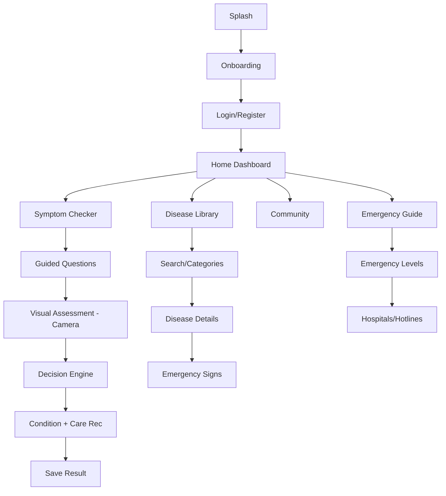

# BabyGuide PH — Implementation Plan (Design-First)

> [!IMPORTANT]
> Per [UI_plan_mobile.md](file:///e:/MELVIN%20FOLDER/APP%20DEV%20TITLE%20PROPOSAL/Project/UI_plan_mobile.md): **Design first, build second.** We complete design research, design system, and component specs before writing any code.

## Architecture

```
Expo Mobile App (SDK 54 / TypeScript / Zustand / TanStack Query)
        │
        ▼
FastAPI Backend (PostgreSQL + SQLAlchemy)
        │
 ┌───────────────┐
 │               │
 ▼               ▼
YOLO Service   Decision Tree Engine
 │               │
 └──────┬────────┘
        ▼
Medical Knowledge Base (PostgreSQL)
        │
        ▼
Care Recommendations
```

| Layer | Technologies |
|-------|-------------|
| **Frontend** | Expo SDK 54, React Native, TypeScript, Zustand, TanStack Query, Expo Camera, Expo Image Picker |
| **Backend** | FastAPI, PostgreSQL, SQLAlchemy, Alembic, JWT |
| **CV Microservice** | YOLOv11/v12, OpenCV, Pillow, FastAPI |
| **Decision Engine** | Rule-based decision tree, Medical knowledge base (PostgreSQL) |

---

# DESIGN PHASES

## D1 — Design Research

Research healthcare, parenting, and medical app patterns from:
- **Mobbin/Dribbble/UI Garage**: Navigation, dashboards, cards, typography, empty/loading states
- **Huckleberry**: Calm dashboard, baby profile, timeline
- **BabyCenter**: Article cards, search, category organization
- **Nara Baby**: Minimalist forms, clean spacing
- **Ada Health / WebMD**: Symptom checker flow, question progression, risk presentation
- **Mayo Clinic**: Medical article formatting, trust-building typography

**Deliverable**: Design research summary document with pattern notes

---

## D2 — Design System & Tokens

Define the complete design language before any screen design:

| Token | Value |
|-------|-------|
| **Primary** | Soft Blue — trust, healthcare |
| **Secondary** | Mint Green — health, growth |
| **Accent** | Warm Yellow — warnings, highlights |
| **Danger** | Soft Red — emergency alerts |
| **Neutrals** | White, Light Gray, Dark Gray |

- **Typography**: Modern sans-serif (e.g., Inter/Nunito), styles: Display → Heading → Title → Subtitle → Body → Caption → Button → Medical Labels
- **Spacing**: 8-point grid (8, 16, 24, 32, 40, 48)
- **Radius**: Small, Medium, Large, Extra Large
- **Shadows/Elevation**: Card, Floating Button, Modal, Bottom Sheet
- **Icons**: Single rounded, medical-friendly icon family
- **Dark/Night mode** palette variant

**Deliverable**: `design_system.md` with all tokens + `theme.ts` token file

---

## D3 — Component Library Design

Spec every reusable component before building screens:

| Category | Components |
|----------|-----------|
| **Buttons** | Primary, Secondary, Outlined, Danger |
| **Cards** | Disease, Recommendation, Community Post, Reminder, Emergency |
| **Inputs** | Text, Search, Password, Dropdown, Date Picker, Checkbox, Radio |
| **Navigation** | Bottom Nav, Top App Bar, Drawer, Tabs |
| **Feedback** | Snackbar, Toast, Alert Dialog, Progress Indicator, Skeleton, Empty State |
| **Badges** | Emergency, Moderate, Low Risk, New, Reminder |
| **Profile** | Avatar, Baby Card, Parent Card, Vaccination Card |
| **Timeline** | Milestones, Medical History, Notifications |

**Deliverable**: Component spec doc with variants, states, and size guidelines

---

## D4 — Information Architecture & User Flows

### Navigation Map

```
Bottom Tabs: Home | Symptom Checker | Disease Library | Community | Profile
Secondary:   Notifications | Emergency Guide | Saved Articles | Settings | Help | Privacy | About
```

### Key User Flows



**Deliverable**: Flow diagrams + screen inventory document

---

# BUILD PHASES

## B0 — Project Scaffolding & Theme Foundation

### Frontend (`frontend/`)
- Scaffold Expo SDK 54 TypeScript project
- Install all deps (react-navigation, reanimated, gesture-handler, lottie, haptics, zustand, tanstack-query, expo-camera, expo-image-picker, etc.)
- `src/theme/` — tokens from D2, ThemeProvider (light/dark), fonts
- `src/components/` — all primitives from D3
- `src/stores/` — Zustand scaffold, `src/lib/` — TanStack Query client
- Splash screen (Lottie), reduced-motion hook

## B1 — Navigation Shell & Home Dashboard
- Bottom tabs + stack navigators, tab animations
- Home dashboard (card grid, quick actions, recent activity, daily tips, baby summary)
- Onboarding carousel with disclaimer

## B2 — Backend Foundation & Auth
- **Backend** (`backend/`): FastAPI scaffold, SQLAlchemy models, Alembic migrations, JWT auth
- Auth endpoints: register (parent/professional), login, forgot-password, logout
- **Frontend**: Login, Register, Forgot Password screens + auth store (Zustand) + TanStack mutations

## B3 — User Profiles
- Parent + Baby profile screens (image picker, date picker)
- History tab, vaccination record, growth tracking
- Backend CRUD endpoints

## B4 — Disease & Symptom Database
- Backend: SQLAlchemy models (Disease, Symptom, Category), CRUD, seed data
- Frontend: searchable list, filter chips, accordion detail, empty-state Lottie
- Offline cache

## B5 — Symptom Checker & Decision Engine
- Rule-based decision tree (JSON/DB-driven)
- Multi-step guided form, symptom chips, animated progress
- Results screen, conditional emergency routing

## B6 — Computer Vision Microservice (`microservice/`)
- FastAPI service with YOLOv11/v12 + OpenCV + Pillow
- `POST /predict` endpoint (image → detections)
- Integration with Expo Camera in symptom checker Visual Assessment step

## B7 — Care Guidance
- Step-by-step instructional UI, linked from checker + disease detail
- Bookmark/save to profile history

## B8 — Emergency Alert
- High-contrast emergency screen, pulsing animation
- Call/maps via expo-linking, hospital/hotline info

## B9 — Community
- Backend: Posts, replies, moderation, professional badges
- Frontend: feed, create post, skeleton loading

## B10 — Analytics / Logging
- Anonymized event schema, logging across all modules
- Backend analytics storage

## B11 — Offline Capability
- Local disease DB cache, offline detection, queue + sync

## B12 — Security & Privacy
- Encrypted storage, HTTPS-only, privacy/disclaimer screens, RBAC

## B13 — Cross-Platform Testing & Polish
- iOS + Android testing, accessibility audit, UI/animation consistency
- Performance on low-end devices, EAS preview build

---

## Complete Screen Inventory (from UI Plan)

| Section | Screens |
|---------|---------|
| **Auth** | Splash, Onboarding, Login, Register, Forgot/Reset Password |
| **Home** | Dashboard, Quick Actions, Recent Activity, Daily Tips, Baby Summary |
| **Checker** | Introduction, Question Flow, Progress, Visual Assessment, Result |
| **Library** | Search, Categories, Disease Details, Bookmark, Recommendations |
| **Emergency** | Emergency Levels, Instructions, Hospitals, Hotlines |
| **Community** | Feed, Post, Comment, Replies |
| **Notifications** | Medication Reminder, Vaccination Reminder, Emergency Alert |
| **Profile** | Parent Profile, Baby Profile, Medical History, Vaccination Record, Growth Tracking |
| **Settings** | Account, Privacy, Theme, Notifications, About |

---

## Verification Plan

- **Design phases**: Review deliverables before moving to build
- **Per build phase**: Expo Go visual check + backend Swagger `/docs` testing
- **Automated**: Jest + RNTL (frontend), pytest + httpx (backend)
- **Final**: Cross-platform device testing, accessibility audit
